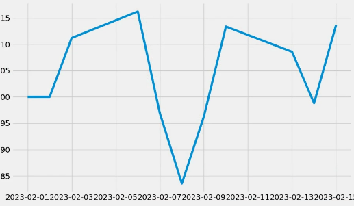
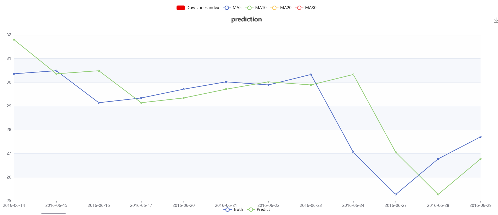

# DM-Project_Stocks-Time-Series-Analysis-

数据挖掘课程项目，实现了股票预测和回测

# 主要完成任务
1. 使用kaggle上的数据集 [New York Stock Exchange](https://www.kaggle.com/datasets/dgawlik/nyse?select=prices-split-adjusted.csv)
并对数据集进行了一些预处理。
2. 基于以上数据集训练了一个[Nonstationary Transformers](https://github.com/thuml/Nonstationary_Transformers/tree/main)模型。
3. 实现一个ARIMA预测模型
4. 基于Windows桌面窗口和网页分别实现了股票的预测和回测系统
5. 实现了基于万得的api接口获取和分析国内的股票的系统
6. 基于Flask实现分析、预测、回测系统的应用后端，基于[ECharts](https://echarts.apache.org/zh/index.html)实现网页前端

# 预备工作
预备工作主要为下面两种功能提供支持
1. 使用万得Wind API插件实时获取国内股票的高开低收和交易量数据
2. 分析已有的[New York Stock Exchange](https://www.kaggle.com/datasets/dgawlik/nyse?select=prices-split-adjusted.csv)高开低收和交易量数据

## Wind API
需要下载万得金融终端，申请万得账号，并按照[Wind API插件使用手册](https://www.windquant.com/qntcloud/apiRefHelp/id-91573a98-70d5-4462-8c6f-546ab45c8652)
进行安装。

## New York Stock Exchange
将[数据集](https://www.kaggle.com/datasets/dgawlik/nyse?select=prices-split-adjusted.csv)下载后，将 prices-split-adjusted.csv 文件放到 meta_data 目录下，
并在该目录下运行preprocess.py
    
    python preprocess.py

# 使用方法

## 窗口前端
在 stock_prediction_and_backtesting_system 目录下运行 price_predict_system.py

    cd stock_prediction_and_backtesting_system
    python price_predict_system.py

可以在windows桌面窗口完成预测和回测。
预测界面

回测界面

回测结果

## 网页前端
在项目目录下运行app.py

    python app.py

输入股票代码以及预测的项目(高开低收)以及训练、测试日期等信息后，可以得到绘制的k线图

注意，股票代码的候选集可以在 data_api/constant.py 里找到，使用万得API的候选集为CODE_LIST；使用New York Stock Exchange数据集的候选集为 NEW_YORK_STOCK_CODE

在完成数据可视化步骤，选择模型(ARIMA, Nonstationary Transformers)后可以对预测的项目进行预测

回测需要基于Wind API完成，在选择多个候选股票代码以及输入有关信息后，可以获得回测盈利率的图像。
