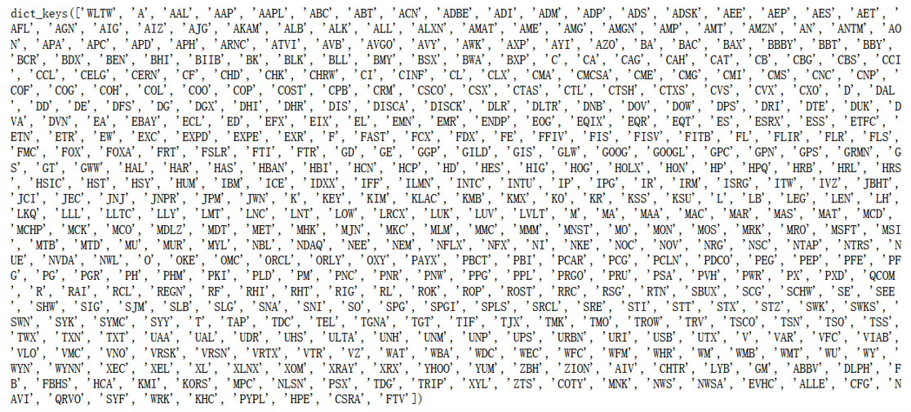
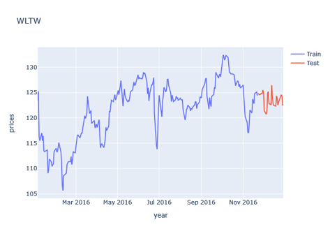
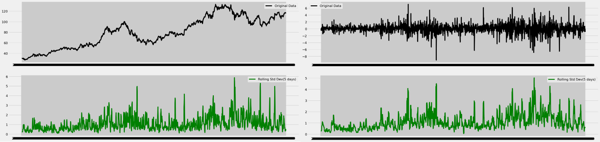
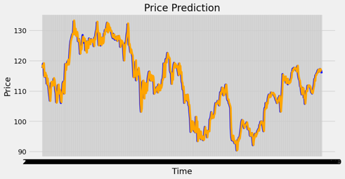
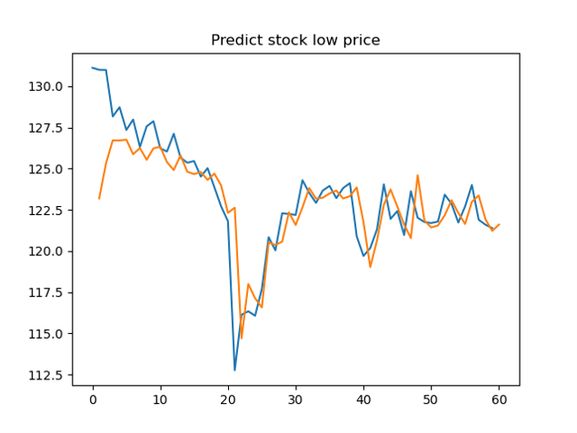
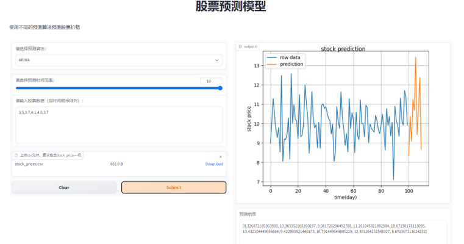

## “项目名称”进展报告

> 撰写时间：2023.4.17
>
> 撰写人：李林翰

### 1. 数据获取及预处理

> 主要说明数据的来源，原始数据的基本情况，如数量，字段，含义等，
> 到目前为止，对数据预处理的情况，如噪声的处理，缺失值的处理等。

#### 1.1 数据来源
数据来源于kaggle，数据集为[New York Stock Exchange](https://www.kaggle.com/datasets/dgawlik/nyse?select=prices-split-adjusted.csv)

#### 1.2 数据说明
这个数据集可以基础和技术分析，我们尝试从历史数据中学到一些规律。

数据包含时间、股票名称、开盘收盘价、当天最低价、当天最高价、成交量，其中数据总量为851264条，时间的范围是2010.1.4-2016.12.30，股票的数量有501支

#### 1.3 数据预处理
我们对这些股票数据进行数据清洗。
删除了离群点股票数据、并对缺失数据进行填充。最终得到了496支股票的数据。

### 2. 数据分析与可视化

对于每一支股票，绘制了每个特征的时序图，以及进行训练集和测试集拆分。

我们进一步进行了差分处理及平稳性检验，因为大多数股票的价格不是平稳的，因此将非平稳的时间序列使用差分的方式处理成平稳的时间序列。

### 3. 模型选取

考虑到这是一个时间序列的数据，因此使用ARIMA模型和LSTM进行建模。

1. ARIMA首先对训练集中的数据进行平稳性检验，如需要则进行差分以获得平稳序列。接着，使用自相关函数（ACF）和偏自相关函数（PACF）等方法确定最佳的自回归阶数（p）和移动平均阶数（q）使用确定的参数（p, d, q）在训练集上训练ARIMA模型；
2. LSTM是深度学习模型，可以结合更多的数据和特征。在实验中可以通过将历史的最高价最低价和开盘收盘价等多元信息作为LSTM的输入，来预测当天的最高价等一元信息，以获得更好的精度。
3. 使用均方误差（MSE）或其他指标来衡量模型的预测准确性；利用已训练的ARIMA模型对未来股票价格进行预测。

### 4. 挖掘实验的结果

1. ARIMA模型：橘色的部分是预测值，蓝色的是真实值，模型已经可以很好地对股票数据进行预测了。

2. LSTM模型：橘色的部分是预测值，蓝色的是真实值，模型也能对数据进行预测，只不过精度欠缺，在训练过程中观察到过拟合现象，因此需要增加数据量，避免LSTM过拟合。

### 5. 系统交互设计

> 主要描述提供的功能及使用方法，输入、输出等。

使用gradio对不同的模型进行统一的封装，并将输入输出抽象化为WEB组件方便进行数据的处理，并且将输出结果进行可视化的展示。

特点：
1. 自由选择预测模型。ARIMA、LSTM等。
2. 自由选择预测的时间范围，也就是预测的长度。
3. 输入：用户可以选择直接输入历史数据，或者上传数据的csv文件，后端可以自动读取文件，并分析
4. 输出：股价预测结果，价格趋势图，净值曲线示例图。

### 6. 存在的问题

1. 数据量不充足，需要获取更多的股票数据，并进行分析，
2. 需要评估模型再不同数据集条件下的表现性能。
3. 对不同股票数据进行相关性分析。
4. 获取社交媒体数据，并尝试分析其与股票数据之间的关系。
5. 模型训练、评估的可视化需要深入。
6. 系统集成需要完善。

### 7. 下一步工作

1. 国内股票自动爬取的接口。
2. 对模型预测结果的解释。
3. 与社交媒体数据结合。

### 8. 任务分配与完成情况
第一阶段分配的任务均已完成

1. 李雨晴：差分处理及平稳性检验，ARIMA模型训练
2. 李林翰：数据预清洗摘要，LSTM模型训练
3. 崔文耀：可视化以及UI设计