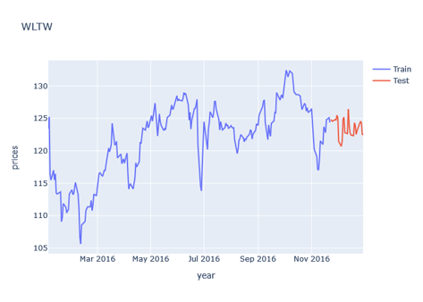
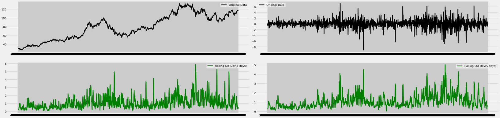
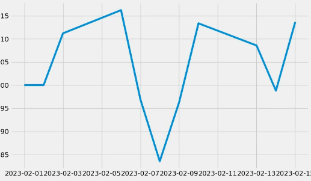

# 项目报告

## 问题提出

股票预测一直是金融领域研究的热点问题。传统的股票预测方法主要包括技术分析、基本面分析等。本项目旨在分析股票市场的主要特点和预测问题，对比不同预测方法的优缺点，并尝试探讨如何应用当代先进的技术来提高股票预测的正确率。本项目在设计了两种股票预测模型并将他们整合进同一个系统中。此外一个良好的UI系统也是非常关键的一环，本项目就这点设计并实现了一套简洁有效的UI界面，方便用户操作。

## 数据分析和可视化

### 数据来源
1. 数据来源于kaggle，数据集为[New York Stock Exchange](https://www.kaggle.com/datasets/dgawlik/nyse?select=prices-split-adjusted.csv)

2. 使用万得Wind API插件实时获取国内股票的高开低收和交易量数据。需要下载万得金融终端，申请万得账号，并按照[Wind API插件使用手册](https://www.windquant.com/qntcloud/apiRefHelp/id-91573a98-70d5-4462-8c6f-546ab45c8652)
进行安装。

### 数据说明
New York Stock Exchange数据集可以基础和技术分析，我们尝试从历史数据中学到一些规律。

数据包含时间、股票名称、开盘收盘价、当天最低价、当天最高价、成交量，其中数据总量为851264条，时间的范围是2010.1.4-2016.12.30，股票的数量有501支

### 数据预处理
我们对这些股票数据进行数据清洗。
删除了离群点股票数据、并对缺失数据进行填充。最终得到了496支股票的数据。


### 分析与可视化

对于每一支股票，绘制了每个特征的时序图，以及进行训练集和测试集拆分。



我们进一步进行了差分处理及平稳性检验，因为大多数股票的价格不是平稳的，因此将非平稳的时间序列使用差分的方式处理成平稳的时间序列。




## 模型探索

考虑到这是一个时间序列的数据，因此使用ARIMA模型和LSTM进行建模。

1. ARIMA首先对训练集中的数据进行平稳性检验，如需要则进行差分以获得平稳序列。接着，使用自相关函数（ACF）和偏自相关函数（PACF）等方法确定最佳的自回归阶数（p）和移动平均阶数（q）使用确定的参数（p, d, q）在训练集上训练ARIMA模型；
2. LSTM是深度学习模型，可以结合更多的数据和特征。在实验中可以通过将历史的最高价最低价和开盘收盘价等多元信息作为LSTM的输入，来预测当天的最高价等一元信息，以获得更好的精度。
3. 使用均方误差（MSE）或其他指标来衡量模型的预测准确性；利用已训练的ARIMA模型对未来股票价格进行预测。

## 实验过程及选择

1. ARIMA模型：橘色的部分是预测值，蓝色的是真实值，模型已经可以很好地对股票数据进行预测了。


2. LSTM模型：橘色的部分是预测值，蓝色的是真实值，模型也能对数据进行预测，只不过精度欠缺，在训练过程中观察到过拟合现象，因此需要增加数据量，避免LSTM过拟合。


## 挖掘结果和展示

### 窗口前端
在 stock_prediction_and_backtesting_system 目录下运行 price_predict_system.py
```bash
    cd stock_prediction_and_backtesting_system
    python price_predict_system.py
```
可以在windows桌面窗口完成预测和回测。
预测界面


回测界面


回测结果



### 网页前端
在项目目录下运行app.py
```bash
    python app.py
```
输入股票代码以及预测的项目(高开低收)以及训练、测试日期等信息后，可以得到绘制的k线图


注意，股票代码的候选集可以在 data_api/constant.py 里找到，使用万得API的候选集为CODE_LIST；使用New York Stock Exchange数据集的候选集为 NEW_YORK_STOCK_CODE

在完成数据可视化步骤，选择模型(ARIMA, Nonstationary Transformers)后可以对预测的项目进行预测


回测需要基于Wind API完成，在选择多个候选股票代码以及输入有关信息后，可以获得回测盈利率的图像。


## 结论

本课程项目对股票预测领域进行了全面的调研和分析。我们从股票市场的特点和预测问题出发，对比了现有的股票预测方法，并探讨了如何利用机器学习、深度学习等先进技术来提高股票预测的正确率和可靠性。实证分析表明，将现代技术应用于股票预测具有较好的实际效果。

在研究过程中，我们得出了以下几点结论：

1. 股票市场具有复杂性、多样性和不确定性等特点，这些因素导致股票预测成为具有挑战性的研究课题。
2. 机器学习、深度学习等先进技术在股票预测领域已经取得了一定成果，可以通过捕捉市场中的复杂关系和隐藏规律来提高预测效果。
3. 结合不同的特征工程技术、优化算法和模型调整策略，有望进一步提升股票预测的准确性和稳定性。


